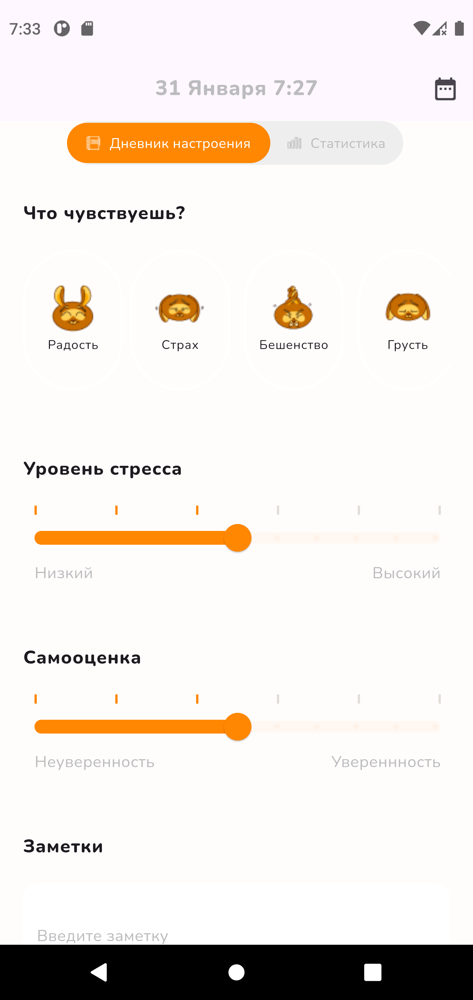
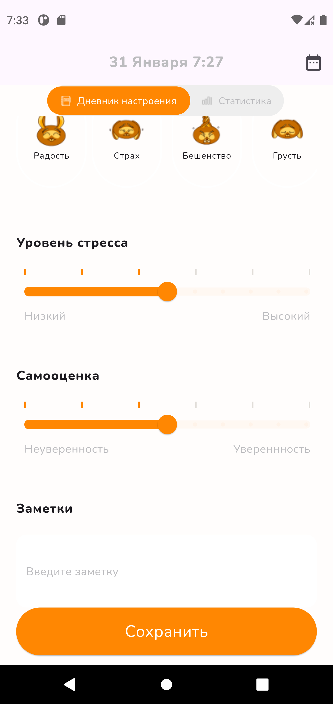
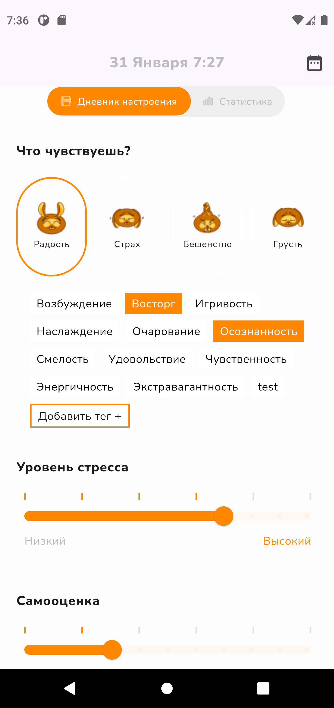
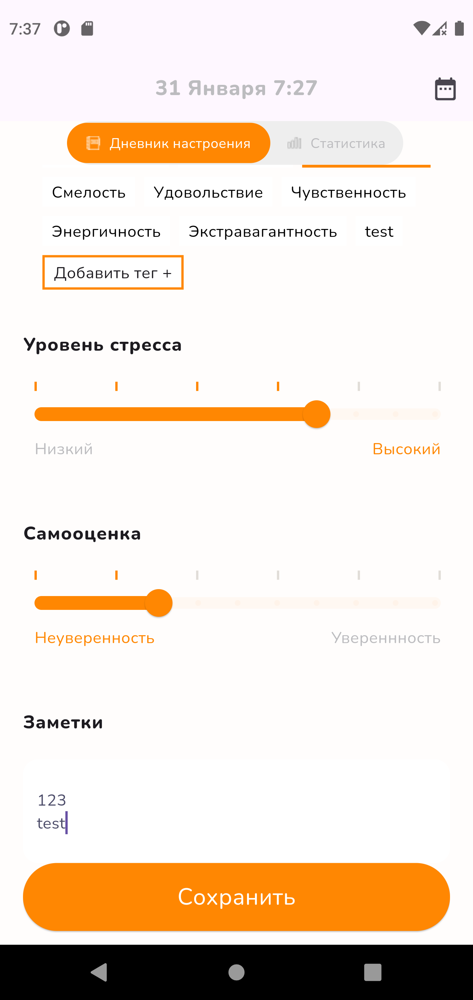
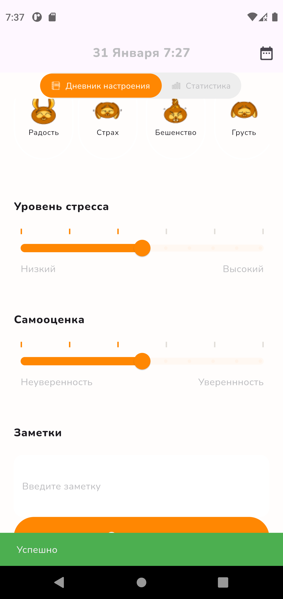
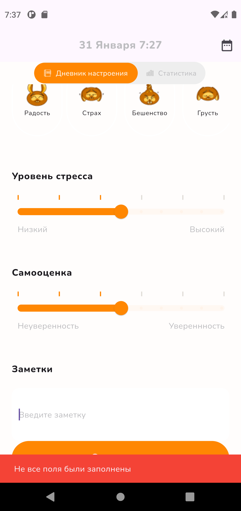
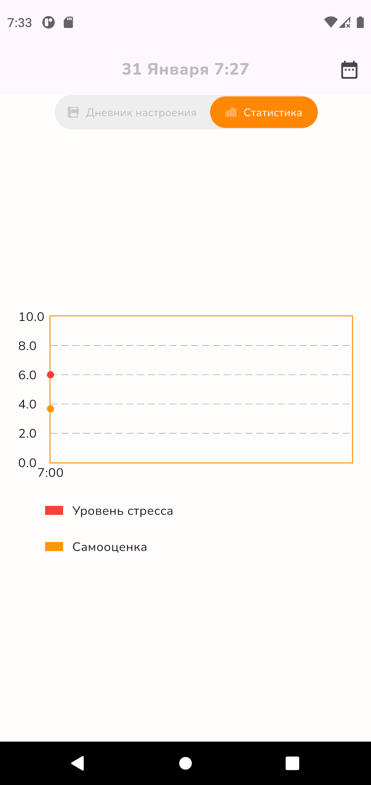
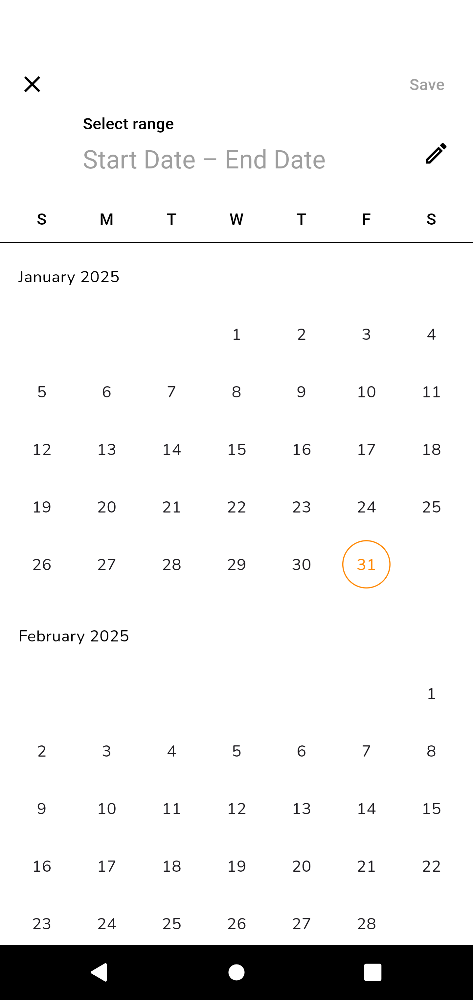
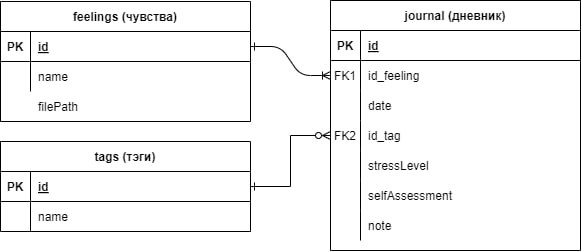

# mood_journal

Test task mood journal

## Что сделано  
Приложение представляет собой дневник настроения, в котором пользователь может фиксировать свое эмоциональное состояние.  
Он должен выбрать `чувство`, после чего он может выбрать `теги`. Теги можно не выбирать, они не являются
обязательными для заполнения.  
Далее пользователь должен выбрать `уровень стресса` и `самооценку`, а также написать `заметку`.

После чего текущее состояние будет сохранено в базу данных (sqlite). Если же заполнены не все необходимые поля, 
то пользователю будет сообщено об этом.

Также присутствует кнопки переключения экранов. Их можно переключаться с помощью кнопки, а также свайпом.
Я не стал использовать пакеты для навигации, потому что подумал, что здесь они излишни.

При переключении экрана можно будет посмотреть график отображающий уровень стресса и самооценки за последние 12 часов.

Также присутствует календарик.

## Визуал

## БД
Нет смысла создавать бд в firebase, хватит простенькой локальной базы данных.  
Для этого подойдет Sqlite.  

